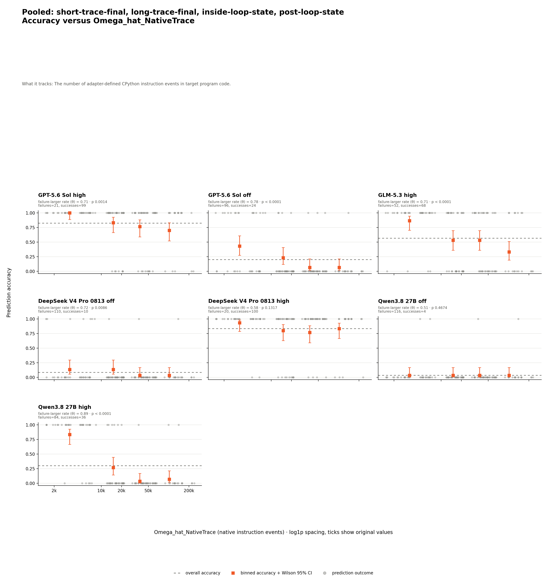
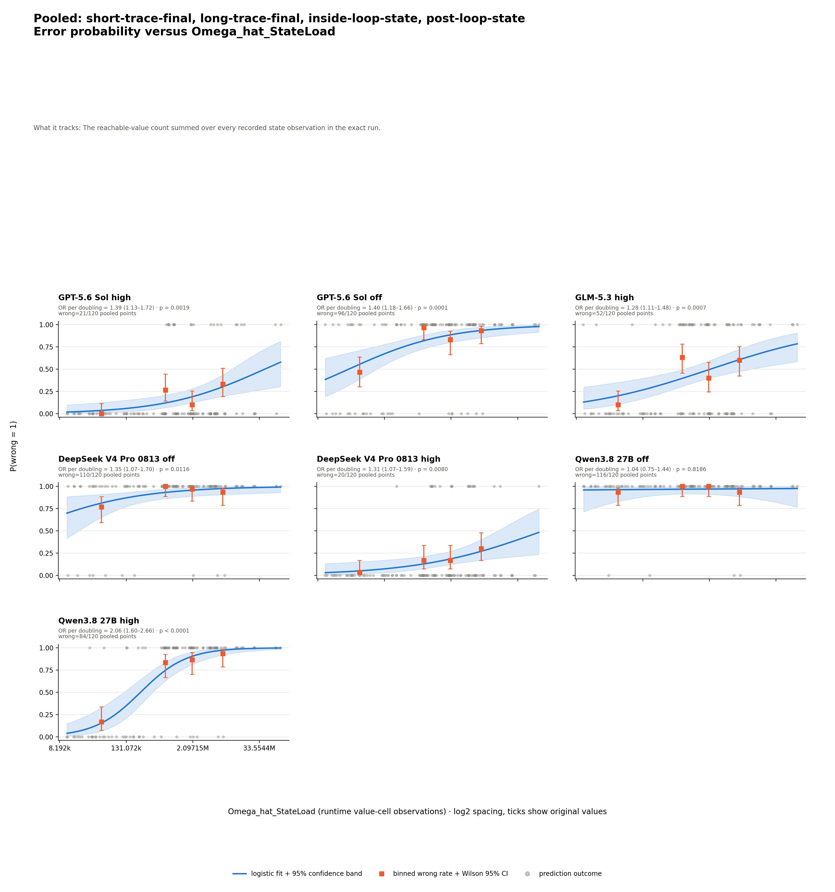

# Classic algorithms state prediction — analysis

## Conclusion

Larger peak state and cumulative state load are associated with prediction
failure for six of seven settings; Qwen off is the exception. Longer native
traces are associated with failure for five settings, but not DeepSeek high or
Qwen off; source cyclomatic complexity has no supported association.

## Results

The table asks how often each model answered each arm correctly. Rows are the
four controlled arms and columns are model settings. Each cell is
`correct/eligible (accuracy)`; `correct_valid` and `correct_invalid` enter the
numerator, and completed wrong envelopes enter the denominator under the shared
[four-way grading contract](../../../shared/grading/README.md). All settings
have 30 eligible predictions per arm.

| Arm | GPT high | GPT off | GLM high | DeepSeek off | DeepSeek high | Qwen off | Qwen high |
| --- | --- | --- | --- | --- | --- | --- | --- |
| `short-trace-final` | 30/30 (100.0%) | 16/30 (53.3%) | 26/30 (86.7%) | 7/30 (23.3%) | 30/30 (100.0%) | 2/30 (6.7%) | 26/30 (86.7%) |
| `long-trace-final` | 28/30 (93.3%) | 6/30 (20.0%) | 20/30 (66.7%) | 2/30 (6.7%) | 27/30 (90.0%) | 2/30 (6.7%) | 8/30 (26.7%) |
| `inside-loop-state` | 20/30 (66.7%) | 0/30 (0.0%) | 10/30 (33.3%) | 0/30 (0.0%) | 19/30 (63.3%) | 0/30 (0.0%) | 1/30 (3.3%) |
| `post-loop-state` | 21/30 (70.0%) | 2/30 (6.7%) | 12/30 (40.0%) | 1/30 (3.3%) | 24/30 (80.0%) | 0/30 (0.0%) | 1/30 (3.3%) |

DeepSeek high answers 100/120 (83.3%), Qwen high answers 36/120 (30.0%),
and Qwen off answers 4/120 (3.3%). The
[matched table](prediction-factor-analysis/data/analysis/matched-accuracy.md)
is identical because every program has an eligible prediction in every arm.

The grader compares JSON values when the oracle is JSON, and whitespace-separated
tokens otherwise; it does not require identical output formatting.

## Which factors are associated with failure

Dynamic factors pool all four arms shown above across 120 distinct exact
source-input executions. No arm is omitted; measurements are joined to model
predictions rather than counted as new executions.

The matrix asks whether wrong predictions tend to have larger dynamic metric
values. Each cell is `theta`, one-sided permutation `p`, and
`n=measured/eligible`; `theta` ranges from 0 to 1 and 0.5 means no ordering
tendency. `n` counts prediction rows, not distinct programs or executions;
shared executions can back several predictions. Bold cells meet the declared
rule `theta > 0.5` and unadjusted `p < 0.05`.

| Dynamic metric | GPT high | GPT off | GLM high | DeepSeek off | DeepSeek high | Qwen off | Qwen high | Supported |
| --- | --- | --- | --- | --- | --- | --- | --- | ---: |
| `Omega_hat_StateLoad` | **theta=0.71<br>p=0.0013<br>n=120/120** | **theta=0.74<br>p=0.0003<br>n=120/120** | **theta=0.67<br>p=0.0011<br>n=120/120** | **theta=0.70<br>p=0.0148<br>n=120/120** | **theta=0.70<br>p=0.0035<br>n=120/120** | theta=0.48<br>p=0.5522<br>n=120/120 | **theta=0.88<br>p < 0.0001<br>n=120/120** | **6/7** |
| `Omega_hat_StateSize` | **theta=0.72<br>p=0.0003<br>n=120/120** | **theta=0.67<br>p=0.0062<br>n=120/120** | **theta=0.65<br>p=0.0025<br>n=120/120** | **theta=0.69<br>p=0.0274<br>n=120/120** | **theta=0.73<br>p=0.0006<br>n=120/120** | theta=0.51<br>p=0.4782<br>n=120/120 | **theta=0.80<br>p < 0.0001<br>n=120/120** | **6/7** |
| `Omega_hat_NativeTrace` | **theta=0.71<br>p=0.0014<br>n=120/120** | **theta=0.78<br>p < 0.0001<br>n=120/120** | **theta=0.71<br>p < 0.0001<br>n=120/120** | **theta=0.72<br>p=0.0086<br>n=120/120** | theta=0.58<br>p=0.1317<br>n=120/120 | theta=0.51<br>p=0.4674<br>n=120/120 | **theta=0.89<br>p < 0.0001<br>n=120/120** | **5/7** |

All 120 profiles carry every dynamic metric. `Omega_CC` is tested separately
by arm; none of its 28 series meets the
declared rule. See the complete
[support matrix](prediction-factor-analysis/data/analysis/metric-matrix.md) and
[shared metric definitions](../../../shared/metrics/README.md).

## The evidence behind each claim

Five NativeTrace series meet the rank-based rule. Qwen high has a mixed binned
pattern, falling from 83.3% in the lowest bin to 6.7% in the highest; DeepSeek
high and Qwen off do not meet the rule. The generated table supplies theta and
permutation p.



StateLoad also has an odds-per-doubling model. Qwen high's wrong-rate bins are
monotone non-decreasing, and its OR is 2.06 (95% CI 1.60–2.66). Qwen off has
OR 1.04 (95% CI 0.75–1.44). These descriptive bins remain secondary to the
rank and regression results.



The exact bins are in
[`chart-data.csv`](prediction-factor-analysis/chart-data.csv), regressions in
[the regression table](prediction-factor-analysis/data/analysis/logistic-regressions.md),
and every detected series in the
[association audit](prediction-factor-analysis/data/analysis/supported-associations.md).

## Limits

| Limitation | Consequence |
| --- | --- |
| Association is not causation | Arm difficulty and metric values can move together. |
| P-values are unadjusted | Related tests should not be read as independent confirmations. |
| Non-significance is not proof of no relationship | Small or imbalanced series may lack power. |
| Predictions cluster within programs | Row-level tests do not model within-program dependence. |
| Measurement coverage | Every model has 120 numeric points for each dynamic metric. |
| DeepSeek off is near the floor | Only 10 of 120 predictions are correct; this does not apply to DeepSeek high. |
| Qwen off is near the floor | Only 4 of 120 predictions are correct, limiting effect estimation. |
| Raw values require the same language adapter | These Python metric values cannot be pooled with another adapter convention. |
| State metrics share one observation stream | StateSize and StateLoad are related summaries, not independent replications. |

## Where the data lives

| Need | Link | What it contains |
| --- | --- | --- |
| Complete evidence | [Analysis artifact index](prediction-factor-analysis/README.md) | Tables, charts, normalized points, manifests, and method. |
| Column and status definitions | [Generated data dictionary](prediction-factor-analysis/data/analysis/README.md) | Fields, units, ranges, and unavailable states. |

## Reproduce

This command uses committed runs and measurements and makes no model calls.

```bash
uv run --python 3.12.11 --with-requirements experiments/classic_algorithms_state_prediction/analysis/requirements.txt python experiments/classic_algorithms_state_prediction/analysis/generate_report.py
```

Provenance and hashes are in the
[analysis manifest](prediction-factor-analysis/data/analysis/analysis-manifest.json)
and [chart manifest](prediction-factor-analysis/chart-manifest.json).
