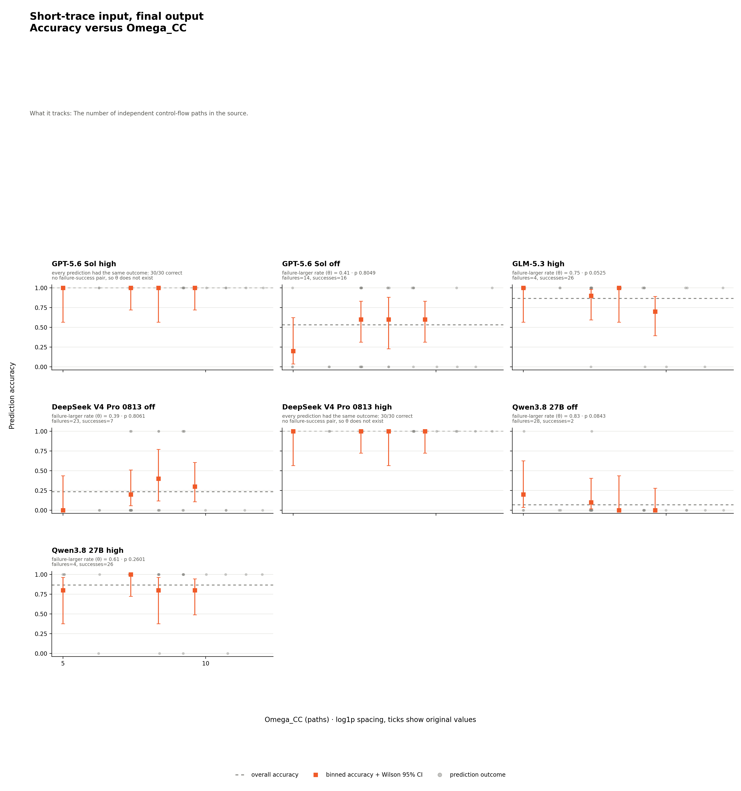
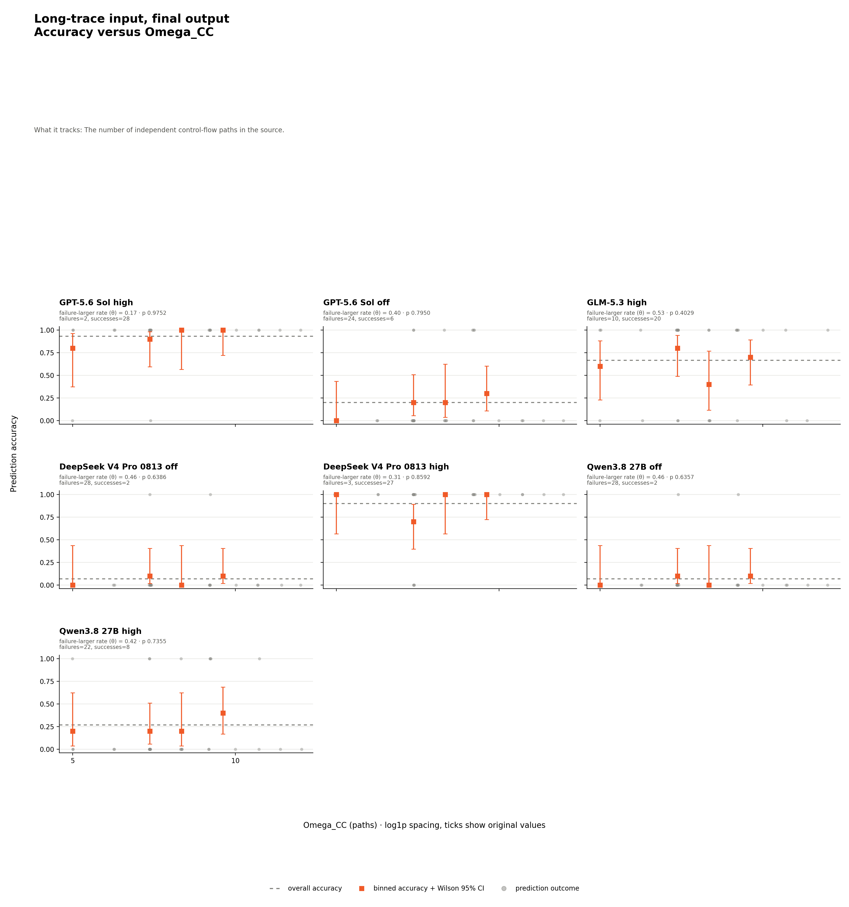
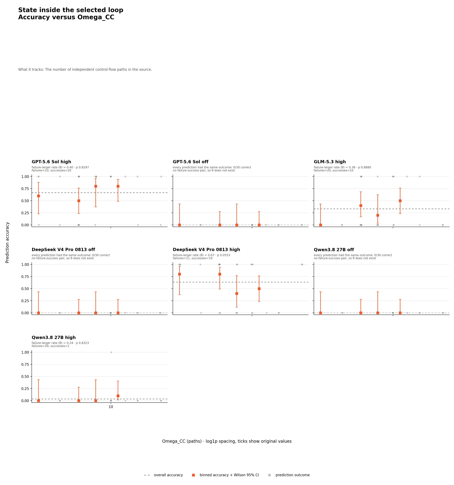
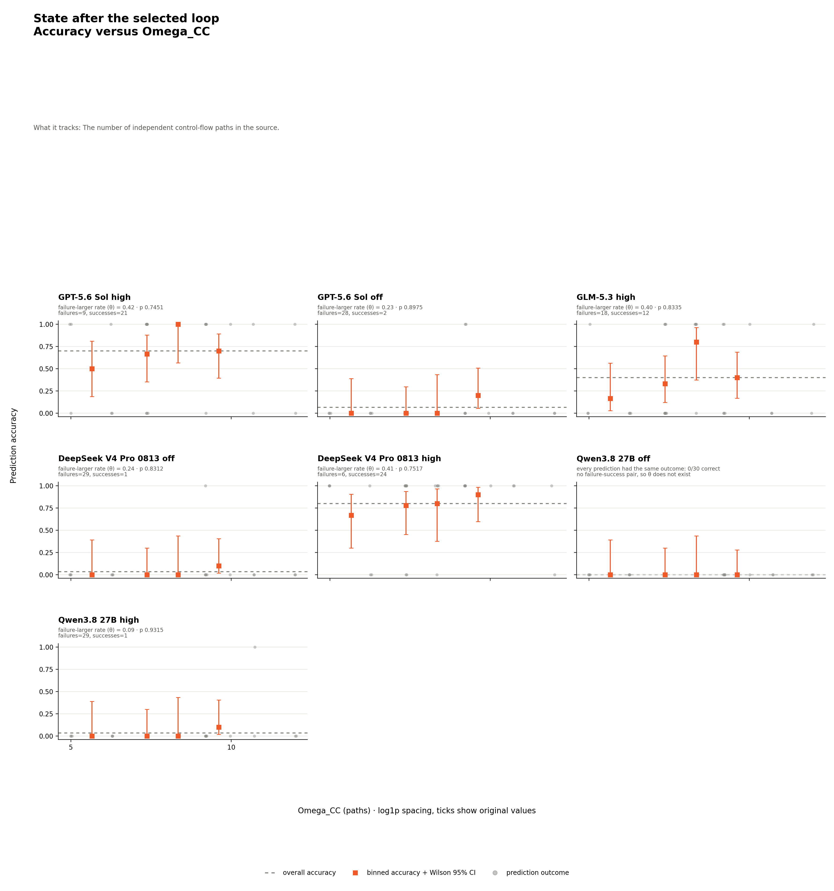
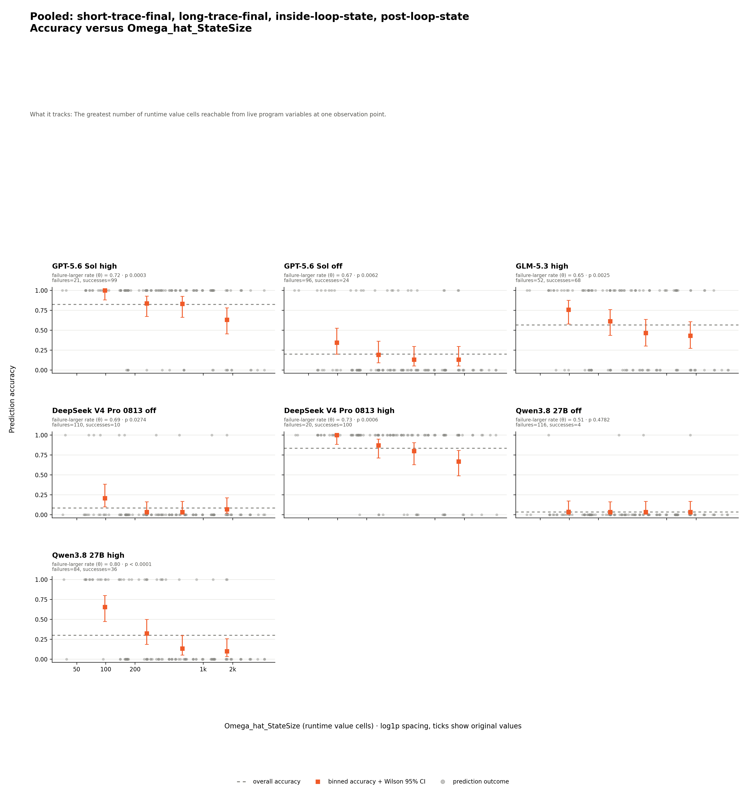

# Metric-accuracy charts

Gray dots are eligible prediction outcomes. Orange squares are tie-preserving binned accuracies with Wilson 95% intervals. The dashed line is overall accuracy. Right-skewed metrics use zero-safe log1p spacing with tick labels in original metric units.

The panel's failure-larger rate (`theta`) is how often a failed prediction has a larger metric value than a successful prediction, ties counting half; `0.5` means no ordering tendency. The permutation `p` is how often shuffled correct/wrong labels produced at least as much separation.

Panel annotations are read unchanged from `series-results.csv`; this generator does not recalculate theta or permutation p-values. Every chart uses the exact metric identifier and explains what it tracks directly below the title.

Configured logistic-regression metrics replace the ordinary accuracy chart at the same `charts/<scope>/<group>/<metric>` path. Their gray dots use `wrong=1`, orange squares show binned wrong rates, and the blue line and 95% confidence band are read unchanged from upstream regression outputs. OR, its 95% interval, and p are likewise rendered without refitting.

## Static metrics

### Short-trace input, final output

#### `Omega_CC`

The number of independent control-flow paths in the source.

### Long-trace input, final output

#### `Omega_CC`

The number of independent control-flow paths in the source.

### State inside the selected loop

#### `Omega_CC`

The number of independent control-flow paths in the source.

### State after the selected loop

#### `Omega_CC`

The number of independent control-flow paths in the source.

## Dynamic metrics

### Pooled: short-trace-final, long-trace-final, inside-loop-state, post-loop-state

#### `Omega_hat_NativeTrace`

The number of adapter-defined CPython instruction events in target program code.

#### `Omega_hat_StateSize`

The greatest number of runtime value cells reachable from live program variables at one observation point.

## Logistic error-probability charts

### `Omega_hat_StateLoad` — Pooled: short-trace-final, long-trace-final, inside-loop-state, post-loop-state

The reachable-value count summed over every recorded state observation in the exact run.

`n` is the number of pooled `(metric value, wrong-or-correct)`
points in the fit. The included arms are not separate regression
groups; their `arm_id` values remain only for audit.

