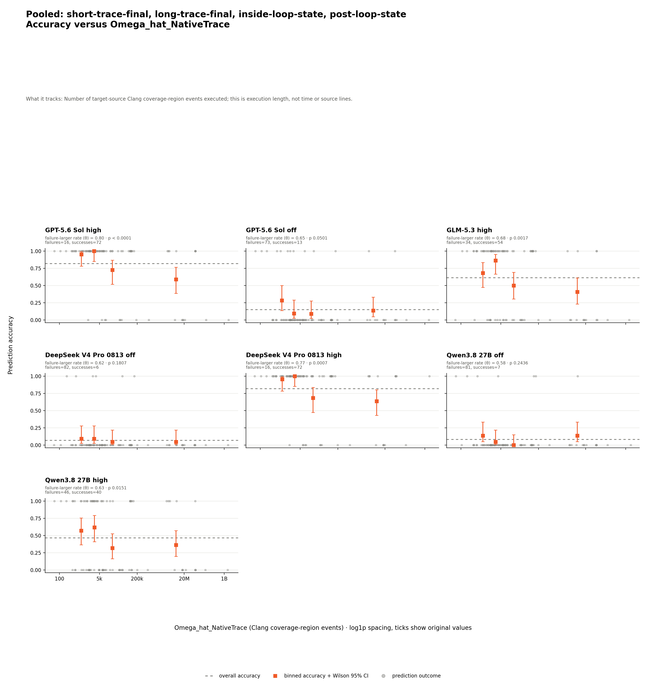
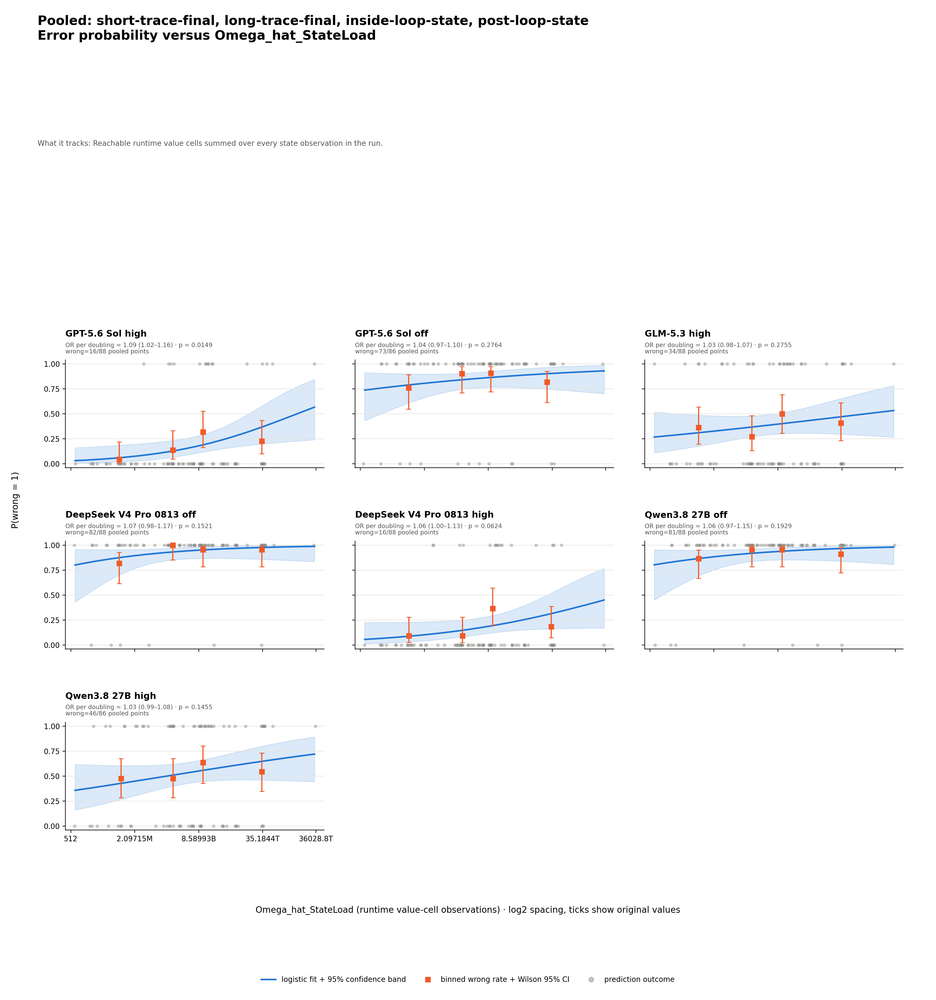

# CodeContests reasoning and state prediction — analysis

## Conclusion

Longer native traces are associated with failure for GPT high, GLM high,
DeepSeek high, and Qwen high. Greater cumulative state load is associated with
failure for GPT high and DeepSeek high, while peak state size has no supported
association. Source cyclomatic complexity has three isolated arm-specific
results.

## Results

The table asks how often each model answered each arm correctly. Rows are arms,
columns are model settings, and each cell is `correct/eligible (accuracy)`.
Both correct grading statuses enter the numerator; completed invalid envelopes
remain eligible. Two GPT-off and two Qwen-high `no_response` predictions are
excluded under the shared
[four-way grading contract](../../../shared/grading/README.md).

| Arm | GPT high | GPT off | GLM high | DeepSeek off | DeepSeek high | Qwen off | Qwen high |
| --- | --- | --- | --- | --- | --- | --- | --- |
| `short-trace-final` | 22/22 (100.0%) | 5/22 (22.7%) | 19/22 (86.4%) | 3/22 (13.6%) | 22/22 (100.0%) | 4/22 (18.2%) | 15/22 (68.2%) |
| `long-trace-final` | 16/22 (72.7%) | 4/22 (18.2%) | 14/22 (63.6%) | 3/22 (13.6%) | 17/22 (77.3%) | 3/22 (13.6%) | 7/22 (31.8%) |
| `inside-loop-state` | 17/22 (77.3%) | 0/21 (0.0%) | 12/22 (54.5%) | 0/22 (0.0%) | 17/22 (77.3%) | 0/22 (0.0%) | 8/21 (38.1%) |
| `post-loop-state` | 17/22 (77.3%) | 4/21 (19.0%) | 9/22 (40.9%) | 0/22 (0.0%) | 16/22 (72.7%) | 0/22 (0.0%) | 10/21 (47.6%) |

All 616 planned cells were collected, and 612 produced gradable predictions.
The correct/eligible totals are GPT high 72/88,
GPT off 13/86, GLM high 54/88, DeepSeek off 6/88, DeepSeek high 72/88,
Qwen off 7/88, and Qwen high 40/86. Two GPT-off and two Qwen-high
`no_response` outcomes are excluded from accuracy denominators.
The [matched table](prediction-factor-analysis/data/analysis/matched-accuracy.md)
uses all 22 GLM programs and 20 GPT-off programs with a gradable answer in
every arm. Its largest within-model arm gap is GLM high: 86.4% on
`short-trace-final` versus 40.9% on `post-loop-state`, a 45.5-point difference.

The headline score compares ordered signed-integer and alphabetic tokens,
ignoring punctuation and whitespace. A separate byte-exact score is retained
in the graded data; the tables here use the token-based score.

## Which factors are associated with failure

Dynamic factors pool all four arms shown above across 88 distinct exact
source-input executions. No arm is omitted; measurements are joined to model
predictions rather than counted as new executions.

The matrix asks whether wrong predictions tend to carry larger dynamic metric
values. Cells show `theta`, one-sided permutation `p`, and
`n=measured/eligible`; theta ranges from 0 to 1, and 0.5 means no ordering
tendency. `n` counts prediction rows, not distinct programs or executions;
one execution measurement may back several predictions. Bold cells meet the
predeclared rule `theta > 0.5` and unadjusted `p < 0.05`.

| Dynamic metric | GPT high | GPT off | GLM high | DeepSeek off | DeepSeek high | Qwen off | Qwen high | Supported |
| --- | --- | --- | --- | --- | --- | --- | --- | ---: |
| `Omega_hat_NativeTrace` | **theta=0.80<br>p < 0.0001<br>n=88/88** | theta=0.65<br>p=0.0501<br>n=86/86 | **theta=0.68<br>p=0.0017<br>n=88/88** | theta=0.62<br>p=0.1807<br>n=88/88 | **theta=0.77<br>p=0.0007<br>n=88/88** | theta=0.58<br>p=0.2436<br>n=88/88 | **theta=0.63<br>p=0.0151<br>n=86/86** | **4/7** |
| `Omega_hat_StateLoad` | **theta=0.70<br>p=0.0060<br>n=88/88** | theta=0.58<br>p=0.1864<br>n=86/86 | theta=0.58<br>p=0.1248<br>n=88/88 | theta=0.66<br>p=0.1008<br>n=88/88 | **theta=0.67<br>p=0.0163<br>n=88/88** | theta=0.61<br>p=0.1825<br>n=88/88 | theta=0.58<br>p=0.1003<br>n=86/86 | **2/7** |
| `Omega_hat_StateSize` | theta=0.54<br>p=0.3334<br>n=88/88 | theta=0.54<br>p=0.3306<br>n=86/86 | theta=0.45<br>p=0.7740<br>n=88/88 | theta=0.63<br>p=0.1577<br>n=88/88 | theta=0.53<br>p=0.3701<br>n=88/88 | theta=0.64<br>p=0.1178<br>n=88/88 | theta=0.51<br>p=0.4208<br>n=86/86 | **0/7** |

Every gradable prediction has all three dynamic measurements. The smaller
GPT-off and Qwen-high denominators each come from two ungradable predictions. `Omega_CC` is
arm-specific: GPT off on `short-trace-final`, plus DeepSeek high and Qwen high
on `post-loop-state`, meet the rule; the other 25 static series do not. See the complete
[support matrix](prediction-factor-analysis/data/analysis/metric-matrix.md) and
[shared metric definitions](../../../shared/metrics/README.md).

## The evidence behind each claim

NativeTrace is supported for GPT high, GLM high, DeepSeek high, and Qwen high.
Each has a mixed rather than monotone four-bin pattern. Qwen high moves from
57.1% in the lowest bin to 36.4% in the highest. These descriptive bins do not
replace theta and permutation p. Qwen high also has one isolated static result
on `post-loop-state`, with a mixed binned pattern.



The StateLoad rank test supports GPT high and DeepSeek high. Their wrong-rate
bins are mixed, with endpoint changes from 4.5% to 22.7% and 9.1% to 18.2%,
respectively. The separate logistic model supports GPT high (OR 1.09, 95% CI
1.02–1.16); the other intervals include one. StateSize has no supported model,
and its descriptive bins are mixed, so they do not justify a trend claim.



The exact bins are in
[`chart-data.csv`](prediction-factor-analysis/chart-data.csv), regressions in
[the regression table](prediction-factor-analysis/data/analysis/logistic-regressions.md),
and all nine supported series in the
[association audit](prediction-factor-analysis/data/analysis/supported-associations.md).

## Limits

| Limitation | Consequence |
| --- | --- |
| Association is not causation | Program difficulty and metric values can move together. |
| P-values are unadjusted | The isolated Omega_CC results need caution. |
| Only 22 programs were selected | Intervals are wide and non-significance is not proof of no relationship. |
| Response eligibility | All 616 cells were attempted, but four no-response outcomes cannot enter accuracy or factor analysis. |
| Measurement coverage | Numeric execution measurements are complete, but the four no-response cells have no gradable outcome to join into factor points. |
| Raw values require the same language adapter | These C++ metric values cannot be pooled with values from another adapter convention. |
| Predictions cluster within programs | Row-level tests do not model within-program dependence. |
| StateSize and StateLoad share observations | They are related summaries, not independent replications. |
| Two off answers are ungradable | Their exclusion makes off-condition accuracy optimistic. |
| DeepSeek off has six successes | Its effect estimates have wide uncertainty despite complete response coverage. |
| Qwen off has seven successes | Its effect estimates also have wide uncertainty despite complete response coverage. |

## Where the data lives

| Need | Link | What it contains |
| --- | --- | --- |
| Complete evidence | [Analysis artifact index](prediction-factor-analysis/README.md) | Tables, charts, normalized points, manifests, and method. |
| Column and status definitions | [Generated data dictionary](prediction-factor-analysis/data/analysis/README.md) | Fields, units, ranges, and unavailable states. |

## Reproduce

This command uses committed runs and measurements and makes no model calls.

```bash
uv run --python 3.12.11 --with-requirements experiments/codecontests_reasoning_state_prediction/analysis/requirements.txt python experiments/codecontests_reasoning_state_prediction/analysis/generate_report.py
```

Provenance and hashes are in the
[analysis manifest](prediction-factor-analysis/data/analysis/analysis-manifest.json)
and [chart manifest](prediction-factor-analysis/chart-manifest.json).
