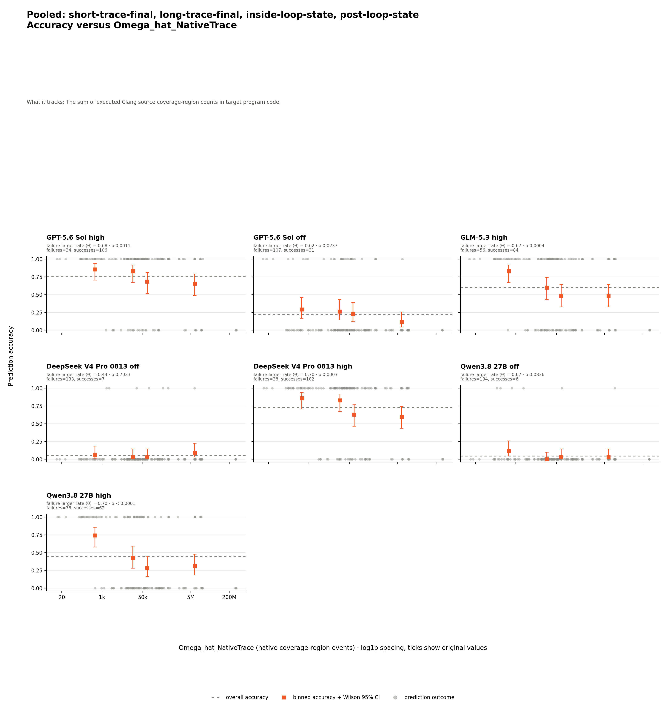
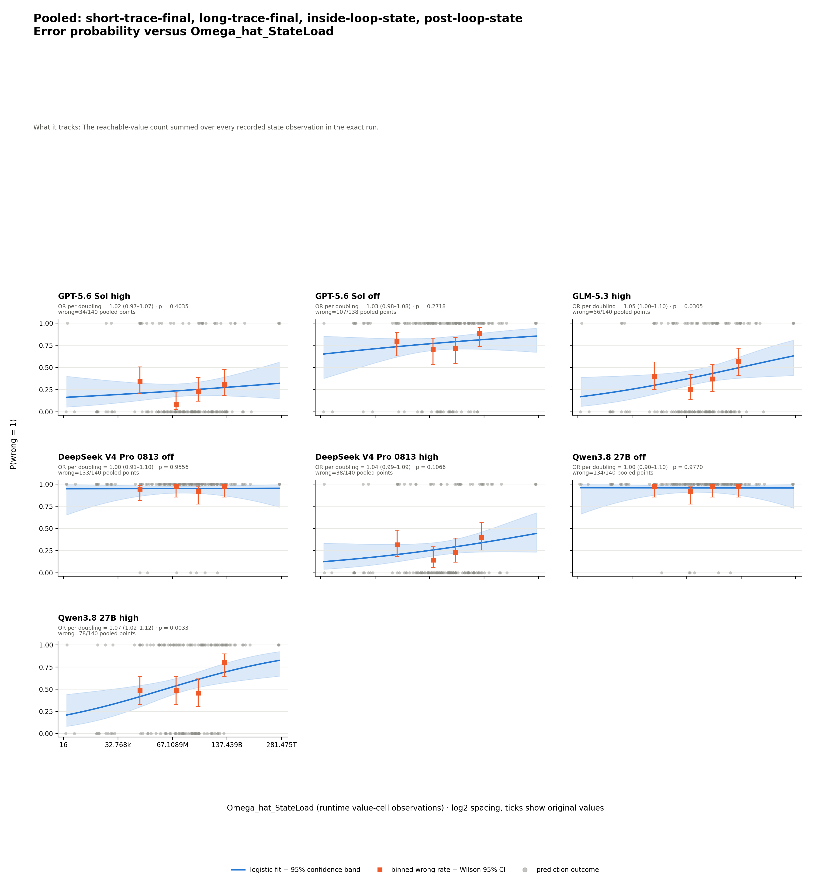
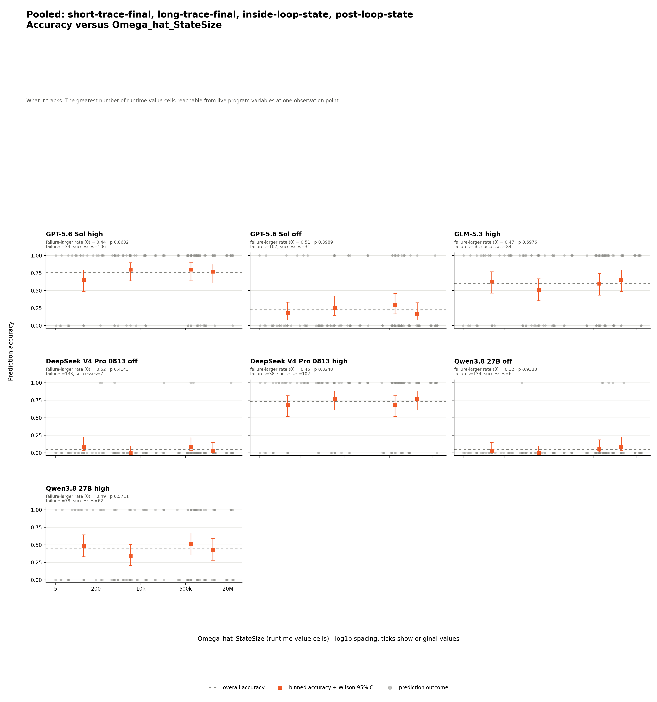

# LiveCodeBench Hard v1 C++20 — analysis

## Conclusion

In the 35-case C++20 cohort, longer Clang NativeTrace is associated with
prediction failure for five of seven model settings. StateLoad meets the
predeclared rule for GLM high and Qwen high, while StateSize and source
cyclomatic complexity have no supported series.

These are associations, not causal effects. The cohort is small, and p-values
are unadjusted across multiple tests.

## Results

The table asks how often each model answered each arm correctly. Rows are arms
and columns are settings. Each cell is `correct/eligible (accuracy)`: both
correct statuses enter the numerator; completed invalid envelopes enter the
denominator; `no_response` is excluded under the shared
[four-way grading contract](../../../shared/grading/README.md).

| Arm | GPT high | GPT off | GLM high | DeepSeek off | DeepSeek high | Qwen off | Qwen high |
| --- | --- | --- | --- | --- | --- | --- | --- |
| `short-trace-final` | 34/35 (97.1%) | 11/35 (31.4%) | 34/35 (97.1%) | 1/35 (2.9%) | 35/35 (100.0%) | 3/35 (8.6%) | 30/35 (85.7%) |
| `long-trace-final` | 26/35 (74.3%) | 8/34 (23.5%) | 21/35 (60.0%) | 4/35 (11.4%) | 22/35 (62.9%) | 3/35 (8.6%) | 13/35 (37.1%) |
| `inside-loop-state` | 25/35 (71.4%) | 5/35 (14.3%) | 15/35 (42.9%) | 1/35 (2.9%) | 23/35 (65.7%) | 0/35 (0.0%) | 10/35 (28.6%) |
| `post-loop-state` | 21/35 (60.0%) | 7/34 (20.6%) | 14/35 (40.0%) | 1/35 (2.9%) | 22/35 (62.9%) | 0/35 (0.0%) | 9/35 (25.7%) |

GPT off has two excluded `no_response` predictions; the other six settings
have complete 140-cell gradable coverage. Qwen high answers 62/140 (44.3%). The
[matched table](prediction-factor-analysis/data/analysis/matched-accuracy.md)
holds the program set fixed within each model.

The grader compares JSON values when the oracle is JSON, and whitespace-separated
tokens otherwise; it does not require identical output formatting.

## Which factors are associated with failure

Dynamic factors pool all four arms shown above across 140 distinct exact
source-input executions. No arm is omitted; measurements are joined to model
predictions rather than counted as new executions.

The matrix asks whether wrong predictions tend to carry larger dynamic metric
values. Rows are pooled runtime factors and columns are settings. Each cell
reports `theta`, one-sided permutation `p`, and
`n=measured/eligible`; `n` counts prediction rows, not distinct programs or
executions. `theta=0.5` means no ordering tendency. Bold cells meet the
predeclared rule `theta > 0.5` and `p < 0.05`. `NOT_MEASURED` values are
excluded, so different `n` values analyze different subsets.

| Dynamic metric | GPT high | GPT off | GLM high | DeepSeek off | DeepSeek high | Qwen off | Qwen high | Supported |
| --- | --- | --- | --- | --- | --- | --- | --- | ---: |
| `Omega_hat_NativeTrace` | **theta=0.68<br>p=0.0011<br>n=140/140** | **theta=0.62<br>p=0.0237<br>n=138/138** | **theta=0.67<br>p=0.0004<br>n=140/140** | theta=0.44<br>p=0.7033<br>n=140/140 | **theta=0.70<br>p=0.0003<br>n=140/140** | theta=0.67<br>p=0.0836<br>n=140/140 | **theta=0.70<br>p < 0.0001<br>n=140/140** | **5/7** |
| `Omega_hat_StateLoad` | theta=0.54<br>p=0.2490<br>n=140/140 | theta=0.56<br>p=0.1647<br>n=138/138 | **theta=0.61<br>p=0.0156<br>n=140/140** | theta=0.52<br>p=0.4160<br>n=140/140 | theta=0.59<br>p=0.0517<br>n=140/140 | theta=0.53<br>p=0.4034<br>n=140/140 | **theta=0.64<br>p=0.0022<br>n=140/140** | **2/7** |
| `Omega_hat_StateSize` | theta=0.44<br>p=0.8632<br>n=140/140 | theta=0.51<br>p=0.3989<br>n=138/138 | theta=0.47<br>p=0.6976<br>n=140/140 | theta=0.52<br>p=0.4143<br>n=140/140 | theta=0.45<br>p=0.8248<br>n=140/140 | theta=0.32<br>p=0.9338<br>n=140/140 | theta=0.49<br>p=0.5711<br>n=140/140 | 0/7 |

`Omega_CC` is tested separately for each arm because the state-arm sources
differ from clean source. No static model-arm series meets the rule; the
complete [metric support matrix](prediction-factor-analysis/data/analysis/metric-matrix.md)
retains every zero-support row and unavailable state. The generated
[supported-association audit](prediction-factor-analysis/data/analysis/supported-associations.md)
lists the seven series that meet the rule.

Metric names, formulas, units, calculation, and interpretation live in the
[shared metric definitions](../../../shared/metrics/README.md).
Adapter coverage and unavailable causes are in the
[measurement package](../measurements/program-complexity/README.md).

## The evidence behind each claim

NativeTrace carries the most consistent evidence, meeting the rank rule in five
settings. Qwen high has a mixed binned pattern, moving from 74.3% accuracy in
the lowest bin to 31.4% in the highest. The bins are descriptive and do not
replace theta and permutation p.



Data: [dynamic association table](prediction-factor-analysis/data/analysis/dynamic-tables.md)
and [`chart-data.csv`](prediction-factor-analysis/chart-data.csv).

StateLoad meets the rank rule for GLM high and Qwen high. Qwen high's binned
wrong rate is mixed, and its odds-per-doubling regression gives OR 1.07
(95% CI 1.02–1.12). These regression p-values are also unadjusted.



Data: [regression table](prediction-factor-analysis/data/analysis/logistic-regressions.md)
and [`logistic-chart-data.csv`](prediction-factor-analysis/logistic-chart-data.csv).

StateSize has zero supported settings.



Data: [machine-readable series results](prediction-factor-analysis/data/analysis/series-results.csv).

## Limits

| Limitation | Consequence |
| --- | --- |
| Association is not causation | Arm difficulty and metric values can move together. |
| P-values are unadjusted | Isolated significant cells require cross-model caution. |
| Non-significance is not proof of no relationship | Small or imbalanced series may lack power. |
| The cohort has 35 programs | Estimates are less stable than in the 283-case Python partition. |
| Measurement coverage | Every selected profile carries NativeTrace, StateSize, and StateLoad. |
| StateSize and StateLoad share one observation stream | They are related summaries, not independent confirmations. |
| Predictions cluster within programs | Row-level permutation and logistic models do not model within-program dependence. |
| Raw values require the same language adapter | C++ values are not pooled with Python values. |
| Ungradable responses are excluded | Two GPT-off predictions are omitted, which is optimistic for that setting. |
| DeepSeek off is near the accuracy floor | Rank associations are difficult to estimate when almost every prediction is wrong. |
| Qwen off is near the accuracy floor | Only 6 of 140 predictions are correct. |

## Where the data lives

| Need | Link | What it contains |
| --- | --- | --- |
| Complete analysis evidence | [Analysis artifact index](prediction-factor-analysis/README.md) | Every generated table, chart, machine-readable result, and the statistical method. |
| Column and status definitions | [Generated data dictionary](prediction-factor-analysis/data/analysis/README.md) | Column meanings, units, ranges, and status vocabulary. |

## Reproduce

These commands use committed runs and measurements and make no model calls.

```bash
uv run --python 3.12.11 --with-requirements experiments/lcb_hard_v1_cpp/analysis/requirements.txt python experiments/lcb_hard_v1_cpp/analysis/generate_report.py
```

Provenance and hashes are in the
[analysis manifest](prediction-factor-analysis/data/analysis/analysis-manifest.json)
and [chart manifest](prediction-factor-analysis/chart-manifest.json).
