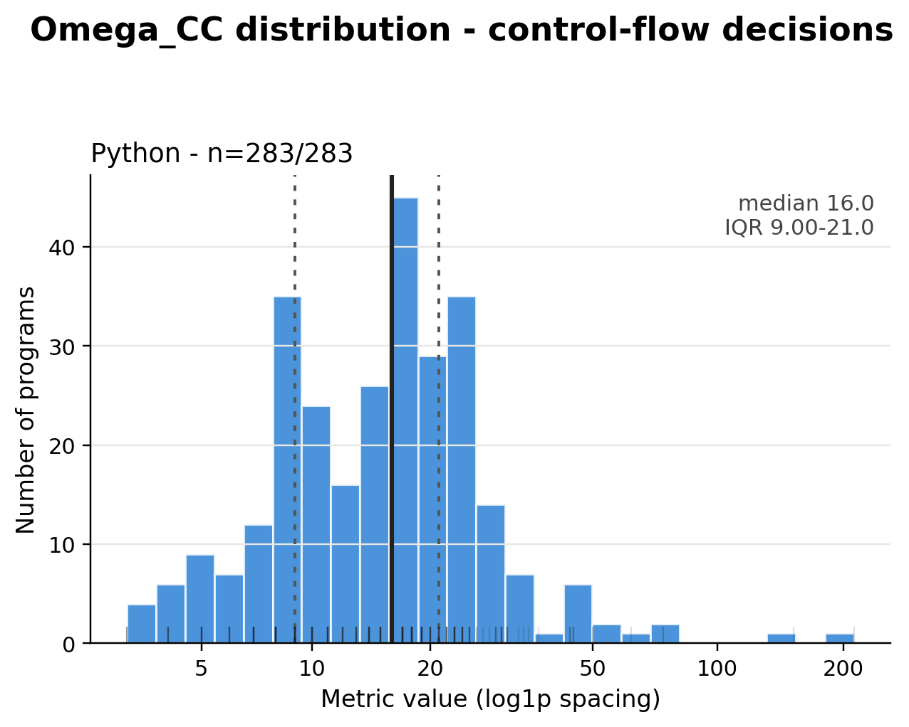

# Program complexity measurements

This directory contains language-native PLSemanticsBench-style profiles for
`lcb_hard_v1_python`. Static profiles cover the actual Python source in all
four arms; dynamic profiles cover the exact source-input executions.

- Python profiles: 1132 (4 arms × 283 programs)
- Scope: complete visible program, excluding the natural-language prompt

Metric names, formulas, units, calculation, and interpretation are defined in
the [shared metric definitions](../../../../shared/metrics/README.md).

## Static metrics and coverage

The retained source metric remains separate from the three execution metrics;
no aggregate score or qualitative difficulty label is produced.

| Metric | Python adapter |
| --- | --- |
| `Omega_CC` | CPython AST-derived control flow |

These values are not pooled with the separately measured C++ experiment.

Python profiles contain `Omega_hat_NativeTrace`, `Omega_hat_StateSize`, and
`Omega_hat_StateLoad`. Each profile records its dynamic execution identity and
oracle. StateSize is the peak of the complete state-observation series, while
StateLoad is its sum.

## Dynamic coverage

The C-walker used one traced pass per execution. Every retained numeric value
is recorded as an ordinary equality measurement and enters all summaries,
factor analyses, and figures.

| Metric | Measured | Unavailable |
| --- | ---: | ---: |
| `Omega_hat_NativeTrace` | 1,132 | 0 |
| `Omega_hat_StateSize` | 1,132 | 0 |
| `Omega_hat_StateLoad` | 1,132 | 0 |

<!-- dataset-complexity-summary:start -->
## Dataset median summary

All metric cells are medians. Dynamic metrics are marked with a hat.
Every numeric value enters as an ordinary measurement.

| Dataset | #Programs | Omega_CC | Omega_hat_NativeTrace | Omega_hat_StateSize | Omega_hat_StateLoad |
| --- | --- | --- | --- | --- | --- |
| lcb_hard_v1_python (Python) | 283 | 16 | 53.7K | 2.38K | 10.7M |

### Cohort

- **lcb_hard_v1_python (Python)**: 283 unique programs; 1132 unique dynamic executions. Static medians use one clean source per case. Dynamic medians use the four canonical execution identities per case.

Metric names, units, and calculation follow the shared definitions linked
by this measurement package. `NOT_MEASURED` means unavailable, not zero.

Raw, unrounded medians are in `dataset-summary.csv`. Input hashes,
deduplication counts, and per-metric availability are in
`dataset-summary-manifest.json`.
<!-- dataset-complexity-summary:end -->

## Static distributions

Each histogram covers all numeric profiles for one language. The vertical lines
show the median and quartiles; the rug shows individual programs. Panels use
independent x-axes and must not be read as cross-language equivalence.

Machine-readable statistics are in `distributions/summary.csv`; plotting and
transformation conventions are in `distributions/analysis-config.json`.

### `Omega_CC`



## Schema and updates

Authoritative profiles live in `<arm>/<language>/profiles.jsonl` for each of
the four arms; adjacent CSV files are flat analysis views.
`normalized-profiles.csv` is the shared long-form view used to combine this
package with other benchmarks; it does not replace those authoritative files.
Each manifest records hashes, method versions, exact problem IDs and per-metric
reuse/recomputation counts. `normalized-profiles.csv` records every assigned
numeric value with `=`. Problem ID is the primary key, and writes are atomic
and deterministically sorted.

Each adjacent `failures.jsonl` contains only parsing or measurement failures.
`NOT_MEASURED` means no numeric value exists. Language-native values are not
directly comparable with the paper's IMP values unless constructs and counting
conventions are compatible.

## Reproduce

```bash
uv run --python 3.12.11 --with-requirements experiments/lcb_hard_v1_python/analysis/requirements.txt python -m experiments.lcb_hard_v1_python.analysis.complexity_distributions --program-root experiments/lcb_hard_v1_python/measurements/program-complexity --benchmark-name lcb_hard_v1_python --arm short-trace-final
uv run --python 3.12.11 python -m experiments.lcb_hard_v1_python.analysis.normalize_complexity_profiles --benchmark experiments/lcb_hard_v1_python
python3 shared/metrics/scripts/summarize_dataset.py --config experiments/lcb_hard_v1_python/measurements/program-complexity/dataset-summary-config.json --output experiments/lcb_hard_v1_python/measurements/program-complexity --readme experiments/lcb_hard_v1_python/measurements/program-complexity/README.md
python3 shared/metrics/scripts/normalize_profiles.py --config experiments/lcb_hard_v1_python/measurements/program-complexity/normalized-profiles-config.json
```

These commands regenerate derived artifacts from the committed measurements;
they do not rerun the C-walker collection.
