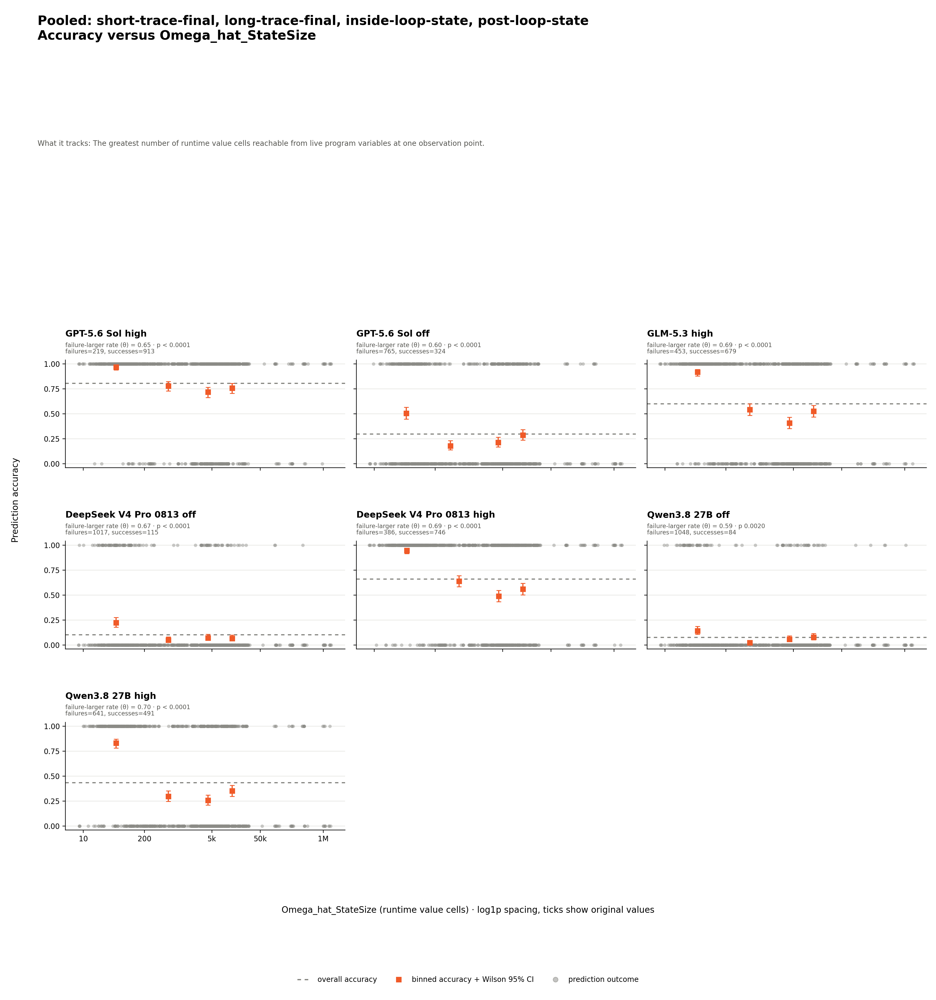
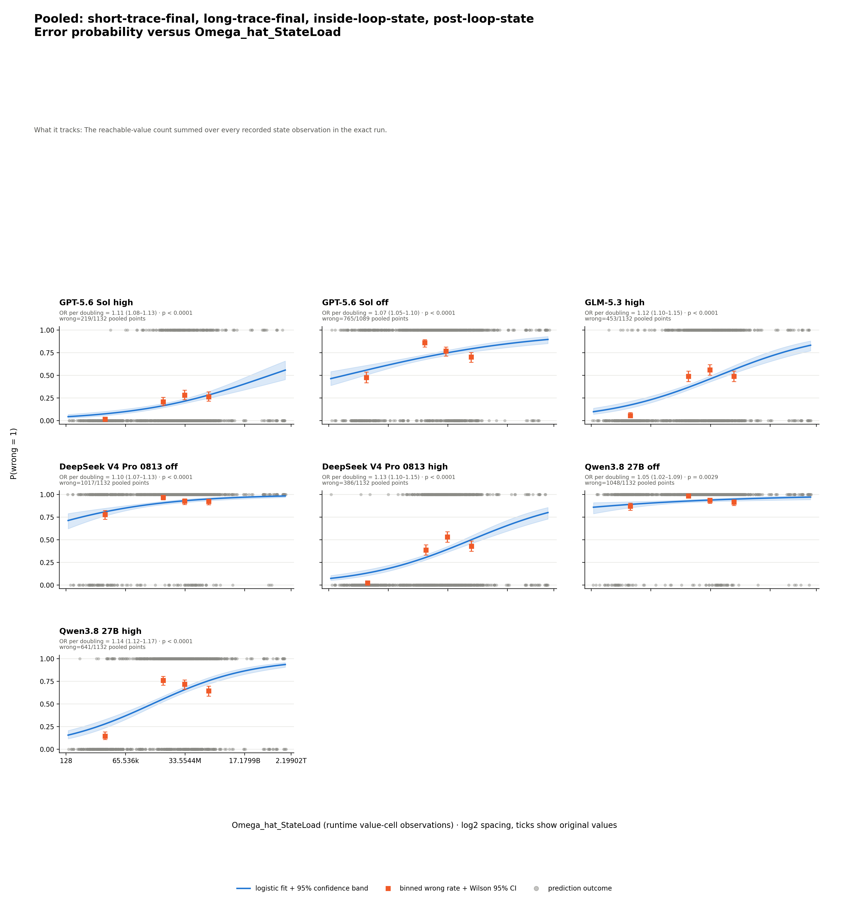
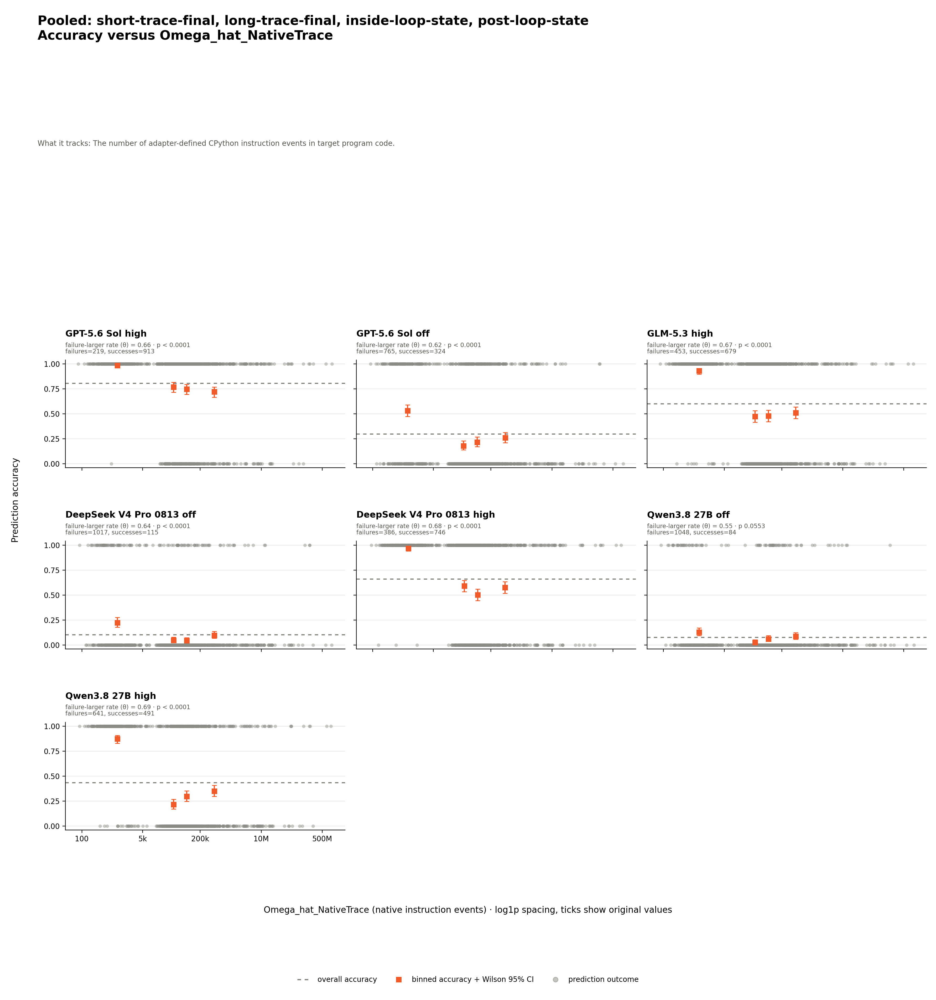

# LiveCodeBench Hard v1 Python — analysis

## Conclusion

In the 283-program Python factor cohort, larger peak state and greater
cumulative state load are associated with prediction failure for all seven
settings. Longer native traces meet the rule for six settings. Source
cyclomatic complexity is most consistent on the post-loop state arm, where
five of seven settings meet the rule.

These results are associations, not causation, and all p-values are unadjusted
across multiple tests.

## Results

The table asks how often each model answered each arm correctly in the 283-case
Python analysis cohort. Rows are arms and columns are settings. Each cell is
`correct/eligible (accuracy)`: both correct statuses enter the numerator;
completed invalid envelopes enter the denominator; `no_response` is excluded
under the shared
[four-way grading contract](../../../shared/grading/README.md).

| Arm | GPT high | GPT off | GLM high | DeepSeek off | DeepSeek high | Qwen off | Qwen high |
| --- | --- | --- | --- | --- | --- | --- | --- |
| `short-trace-final` | 282/283 (99.6%) | 153/283 (54.1%) | 270/283 (95.4%) | 66/283 (23.3%) | 279/283 (98.6%) | 40/283 (14.1%) | 257/283 (90.8%) |
| `long-trace-final` | 236/283 (83.4%) | 112/279 (40.1%) | 203/283 (71.7%) | 49/283 (17.3%) | 218/283 (77.0%) | 44/283 (15.5%) | 149/283 (52.7%) |
| `inside-loop-state` | 200/283 (70.7%) | 25/268 (9.3%) | 108/283 (38.2%) | 0/283 (0.0%) | 152/283 (53.7%) | 0/283 (0.0%) | 47/283 (16.6%) |
| `post-loop-state` | 195/283 (68.9%) | 34/259 (13.1%) | 98/283 (34.6%) | 0/283 (0.0%) | 97/283 (34.3%) | 0/283 (0.0%) | 38/283 (13.4%) |

GPT off has 43 excluded `no_response` predictions; the other six settings
have complete 1,132-cell coverage. Qwen high answers 491/1,132 (43.4%). The
[matched table](prediction-factor-analysis/data/analysis/matched-accuracy.md)
holds the program set fixed per model.

The grader compares JSON values when the oracle is JSON, and whitespace-separated
tokens otherwise; it does not require identical output formatting.

## Which factors are associated with failure

Dynamic factors pool all four arms shown above across 1,132 distinct exact
source-input executions. No arm is omitted; measurements are joined to model
predictions rather than counted as new executions.

The matrix below asks whether wrong predictions tend to carry larger dynamic
metric values. Rows are pooled runtime factors and columns are model settings.
Every cell reports `theta`, one-sided permutation `p`, and
`n=measured/eligible`; `n` counts prediction rows, not distinct programs or
executions, and shared execution measurements can back several predictions.
`theta` ranges from 0 to 1, with 0.5 meaning no ordering tendency. Bold cells
meet the predeclared rule `theta > 0.5` and `p < 0.05`. Every assigned numeric
measurement enters normally. All 1,132 retained executions have numeric values
for each dynamic metric.

| Dynamic metric | GPT high | GPT off | GLM high | DeepSeek off | DeepSeek high | Qwen off | Qwen high | Supported |
| --- | --- | --- | --- | --- | --- | --- | --- | ---: |
| `Omega_hat_StateLoad` | **theta=0.67<br>p < 0.0001<br>n=1132/1132** | **theta=0.60<br>p < 0.0001<br>n=1089/1089** | **theta=0.68<br>p < 0.0001<br>n=1132/1132** | **theta=0.65<br>p < 0.0001<br>n=1132/1132** | **theta=0.69<br>p < 0.0001<br>n=1132/1132** | **theta=0.57<br>p=0.0201<br>n=1132/1132** | **theta=0.69<br>p < 0.0001<br>n=1132/1132** | **7/7** |
| `Omega_hat_StateSize` | **theta=0.65<br>p < 0.0001<br>n=1132/1132** | **theta=0.60<br>p < 0.0001<br>n=1089/1089** | **theta=0.69<br>p < 0.0001<br>n=1132/1132** | **theta=0.67<br>p < 0.0001<br>n=1132/1132** | **theta=0.69<br>p < 0.0001<br>n=1132/1132** | **theta=0.59<br>p=0.0020<br>n=1132/1132** | **theta=0.70<br>p < 0.0001<br>n=1132/1132** | **7/7** |
| `Omega_hat_NativeTrace` | **theta=0.66<br>p < 0.0001<br>n=1132/1132** | **theta=0.62<br>p < 0.0001<br>n=1089/1089** | **theta=0.67<br>p < 0.0001<br>n=1132/1132** | **theta=0.64<br>p < 0.0001<br>n=1132/1132** | **theta=0.68<br>p < 0.0001<br>n=1132/1132** | theta=0.55<br>p=0.0553<br>n=1132/1132 | **theta=0.69<br>p < 0.0001<br>n=1132/1132** | **6/7** |

`Omega_CC` is static and therefore tested separately for each arm. Five of seven
settings meet the rule on `post-loop-state`; GLM, GPT off, and Qwen high meet it
on `inside-loop-state`, and Qwen high also meets it on `short-trace-final`. The complete
[metric support matrix](prediction-factor-analysis/data/analysis/metric-matrix.md)
keeps every zero-support arm and model cell.

Metric names, formulas, units, and calculations live in the
[shared metric definitions](../../../shared/metrics/README.md).
Measurement-specific coverage and limits are in the
[measurement package](../measurements/program-complexity/README.md).

## The evidence behind each claim

Peak state size meets the rank rule for all seven settings. Qwen high has a
mixed binned pattern, moving from 83.0% in the lowest bin to 35.1% in the
highest. The bins do not replace theta and permutation p.



Data: [`chart-data.csv`](prediction-factor-analysis/chart-data.csv) and
[`series-results.csv`](prediction-factor-analysis/data/analysis/series-results.csv).

Cumulative state load is shown as error probability because it also has the
requested odds-per-doubling regression. All seven confidence intervals exclude
one. Qwen high's wrong-rate bins are mixed, and its OR is 1.14 per doubling
(95% CI 1.12–1.17); the linked table gives all seven fits.



Data: [regression table](prediction-factor-analysis/data/analysis/logistic-regressions.md)
and [`logistic-chart-data.csv`](prediction-factor-analysis/logistic-chart-data.csv).

Native trace length is supported for six settings. Qwen off is the exception:
`theta=0.55` and `p=0.0553` do not meet the predeclared rule. Qwen high's
binned shape is mixed, so it remains descriptive and does not replace `theta`
and permutation `p`.



Data: [dynamic association table](prediction-factor-analysis/data/analysis/dynamic-tables.md).
The complete generated audit contains
[all 29 supported series](prediction-factor-analysis/data/analysis/supported-associations.md).

## Limits

| Limitation | Consequence |
| --- | --- |
| Association is not causation | Arm difficulty and metric values can move together. |
| P-values are unadjusted | Isolated significant cells require cross-model caution. |
| Non-significance is not proof of no relationship | Small or imbalanced series may lack power. |
| StateSize and StateLoad share one observation stream | They are related summaries, not independent confirmations. |
| Predictions cluster within programs | The row-level permutation and logistic models do not model within-program dependence. |
| Raw values require the same language adapter | This report covers Python only; the C++20 partition has its own analysis. |
| Measurement coverage is complete for the retained cohort | All three dynamic metrics have values for all 1,132 retained executions, so no prediction is lost because a metric is unavailable. |
| Ungradable responses are excluded | This makes the GPT-off results optimistic. |
| Two GPT-off condition deviations | The selected `atcoder/abc315_e/post-loop-state/r001` and `atcoder/abc303_e/post-loop-state/r003` responses contain thinking blocks and positive reported reasoning usage. They remain in the published scores, so this setting is not a uniformly verified no-reasoning cohort. |
| DeepSeek off state accuracy is at the floor | It answered 0 of 566 Python state-arm predictions correctly; this does not apply to the high settings. |
| Qwen off state accuracy is at the floor | It also answered 0 of 566 Python state-arm predictions correctly. |

## Where the data lives

| Need | Link | What it contains |
| --- | --- | --- |
| Complete analysis evidence | [Analysis artifact index](prediction-factor-analysis/README.md) | Every generated table, chart, machine-readable result, and the statistical method. |
| Column and status definitions | [Generated data dictionary](prediction-factor-analysis/data/analysis/README.md) | The meaning, unit, range, and status vocabulary for every committed data column. |

## Reproduce

These commands use committed runs and measurements and make no model calls.

```bash
uv run --python 3.12.11 --with-requirements experiments/lcb_hard_v1_python/analysis/requirements.txt python experiments/lcb_hard_v1_python/analysis/generate_report.py
```

Provenance and hashes are in the
[analysis manifest](prediction-factor-analysis/data/analysis/analysis-manifest.json)
and [chart manifest](prediction-factor-analysis/chart-manifest.json).
