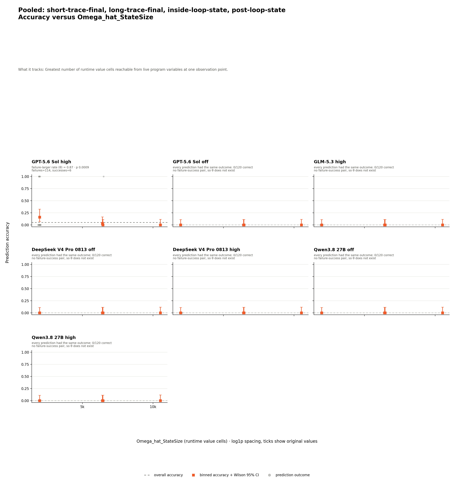
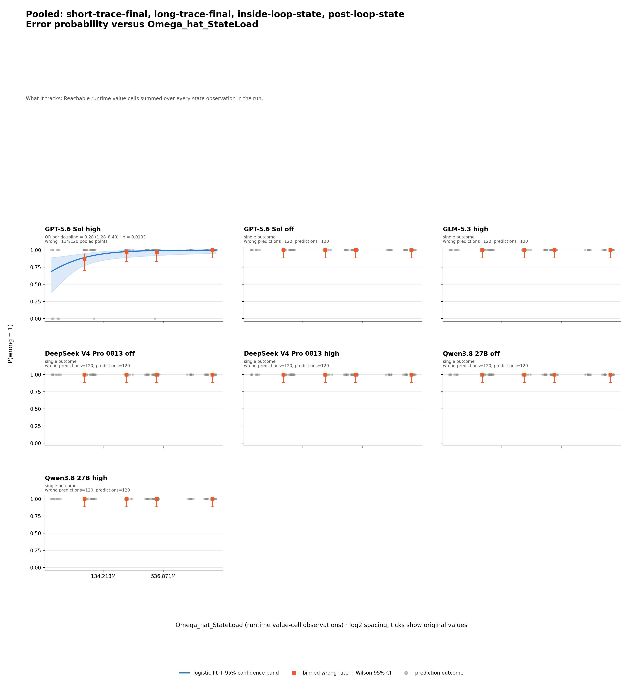

# NetworkX network simplex state prediction — analysis

## Conclusion

The benchmark is near the floor: GPT-5.6 Sol high answers 6 of 120 predictions
correctly, while GPT off, GLM high, DeepSeek off, DeepSeek high, Qwen off, and
Qwen high each answer 0 of 120. Larger dynamic metrics are associated with
failure only for GPT high; the six all-wrong settings cannot estimate that
association.

## Results

The table asks how often each model answered each arm correctly. Rows are arms,
columns are model settings, and each cell is `correct/eligible (accuracy)`.
Both correct grading statuses enter the numerator under the shared
[four-way grading contract](../../../shared/grading/README.md); every one of the
840 predictions is gradable, so there are no excluded or ungradable
outcomes.

| Arm | GPT-5.6 Sol high | GPT-5.6 Sol off | GLM high | DeepSeek off | DeepSeek high | Qwen off | Qwen high |
| --- | --- | --- | --- | --- | --- | --- | --- |
| `short-trace-final` | 4/30 (13.3%) | 0/30 (0.0%) | 0/30 (0.0%) | 0/30 (0.0%) | 0/30 (0.0%) | 0/30 (0.0%) | 0/30 (0.0%) |
| `long-trace-final` | 2/30 (6.7%) | 0/30 (0.0%) | 0/30 (0.0%) | 0/30 (0.0%) | 0/30 (0.0%) | 0/30 (0.0%) | 0/30 (0.0%) |
| `inside-loop-state` | 0/30 (0.0%) | 0/30 (0.0%) | 0/30 (0.0%) | 0/30 (0.0%) | 0/30 (0.0%) | 0/30 (0.0%) | 0/30 (0.0%) |
| `post-loop-state` | 0/30 (0.0%) | 0/30 (0.0%) | 0/30 (0.0%) | 0/30 (0.0%) | 0/30 (0.0%) | 0/30 (0.0%) | 0/30 (0.0%) |

The [matched table](prediction-factor-analysis/data/analysis/matched-accuracy.md)
is identical because all programs are gradable in all arms. High falls by 13.3
percentage points from short final output to either state arm; the other six
settings remain at zero throughout. DeepSeek high has 12 `wrong_invalid`
responses, including five completed responses with reasoning but no final
answer; all remain eligible wrong predictions.

The grader compares the decoded predicted output with the oracle byte-for-byte,
including JSON serialization and the final newline.

## Which factors are associated with failure

Dynamic factors pool all four arms shown above across 120 distinct exact
source-input executions. No arm is omitted; measurements are joined to model
predictions rather than counted as new executions.

The matrix asks whether wrong predictions tend to carry larger dynamic metric
values. Cells show `theta`, one-sided permutation `p`, and
`n=measured/eligible`; theta ranges from 0 to 1, with 0.5 meaning no ordering
tendency. `n` counts prediction rows, not distinct programs or executions;
one execution measurement may back several predictions. Bold cells meet the
predeclared rule `theta > 0.5` and unadjusted `p < 0.05`. `— (0/120 correct)`
means every selected prediction was wrong, so no wrong-versus-correct pair
exists and theta is undefined; it does not mean missing data.

| Dynamic metric | GPT-5.6 Sol high | GPT-5.6 Sol off | GLM high | DeepSeek off | DeepSeek high | Qwen off | Qwen high | Supported |
| --- | --- | --- | --- | --- | --- | --- | --- | ---: |
| `Omega_hat_StateSize` | **theta=0.87<br>p=0.0009<br>n=120/120** | — (0/120 correct) | — (0/120 correct) | — (0/120 correct) | — (0/120 correct) | — (0/120 correct) | — (0/120 correct) | **1/7** |
| `Omega_hat_StateLoad` | **theta=0.84<br>p=0.0013<br>n=120/120** | — (0/120 correct) | — (0/120 correct) | — (0/120 correct) | — (0/120 correct) | — (0/120 correct) | — (0/120 correct) | **1/7** |
| `Omega_hat_NativeTrace` | **theta=0.84<br>p=0.0016<br>n=120/120** | — (0/120 correct) | — (0/120 correct) | — (0/120 correct) | — (0/120 correct) | — (0/120 correct) | — (0/120 correct) | **1/7** |

All 120 program-arm profiles carry all three dynamic measurements: there are no
measurement failures, unsupported types, adapters not run, or unrequested
profiles. `Omega_CC` is tested separately in 28 model-by-arm series; none meets
the rule, and 26 are undefined because an arm is all wrong. See the
complete [support matrix](prediction-factor-analysis/data/analysis/metric-matrix.md)
and [shared metric definitions](../../../shared/metrics/README.md).

## The evidence behind each claim

For GPT high, the StateSize descriptive bins are monotone non-increasing from
5/31 correct in the lowest bin to 0/29 correct in the highest. The rank
statistic, not visual monotonicity, defines the association.



StateLoad has a fitted GPT-high error-odds ratio of 3.28 per doubling (95%
CI 1.28–8.40). Its descriptive wrong-rate bins are monotone non-decreasing,
moving from 26/30 wrong in the lowest bin to 30/30 in the highest. No curve is
fitted for the six all-wrong settings because each outcome is constant.



The exact bins are in
[`chart-data.csv`](prediction-factor-analysis/chart-data.csv), regressions in
[the regression table](prediction-factor-analysis/data/analysis/logistic-regressions.md),
and all three supported series in the
[association audit](prediction-factor-analysis/data/analysis/supported-associations.md).

## Limits

| Limitation | Consequence |
| --- | --- |
| Near-floor accuracy | Only six high-setting successes support every dynamic comparison. |
| Six settings are all wrong | GPT off, GLM high, DeepSeek off, DeepSeek high, Qwen off, and Qwen high have undefined theta and logistic slopes. |
| Association is not causation | Program difficulty and metric values can move together. |
| P-values are unadjusted | Three related dynamic tests should not be read as independent confirmations. |
| Non-significance is not proof of no relationship | The static tests have almost no successful predictions to compare. |
| Measurement coverage | Profile coverage is complete, but outcome variation is absent for six settings and nearly absent for GPT high. |
| DeepSeek high has completed no-answer outcomes | Five completed responses contain reasoning but no final text; they remain completed wrong predictions. |
| Raw values require the same language adapter | These Python metric values cannot be pooled with another adapter convention. |
| Predictions cluster within programs | Row-level tests do not model within-program dependence. |
| State metrics share observations | StateSize and StateLoad are related summaries. |

## Where the data lives

| Need | Link | What it contains |
| --- | --- | --- |
| Complete evidence | [Analysis artifact index](prediction-factor-analysis/README.md) | Tables, charts, normalized points, manifests, and method. |
| Column and status definitions | [Generated data dictionary](prediction-factor-analysis/data/analysis/README.md) | Fields, units, ranges, and unavailable states. |

## Reproduce

This command uses committed runs and measurements and makes no model calls.

```bash
uv run --python 3.12.11 --with-requirements experiments/networkx_network_simplex_state_prediction/analysis/requirements.txt python experiments/networkx_network_simplex_state_prediction/analysis/generate_report.py
```

Provenance and hashes are in the
[analysis manifest](prediction-factor-analysis/data/analysis/analysis-manifest.json)
and [chart manifest](prediction-factor-analysis/chart-manifest.json).
